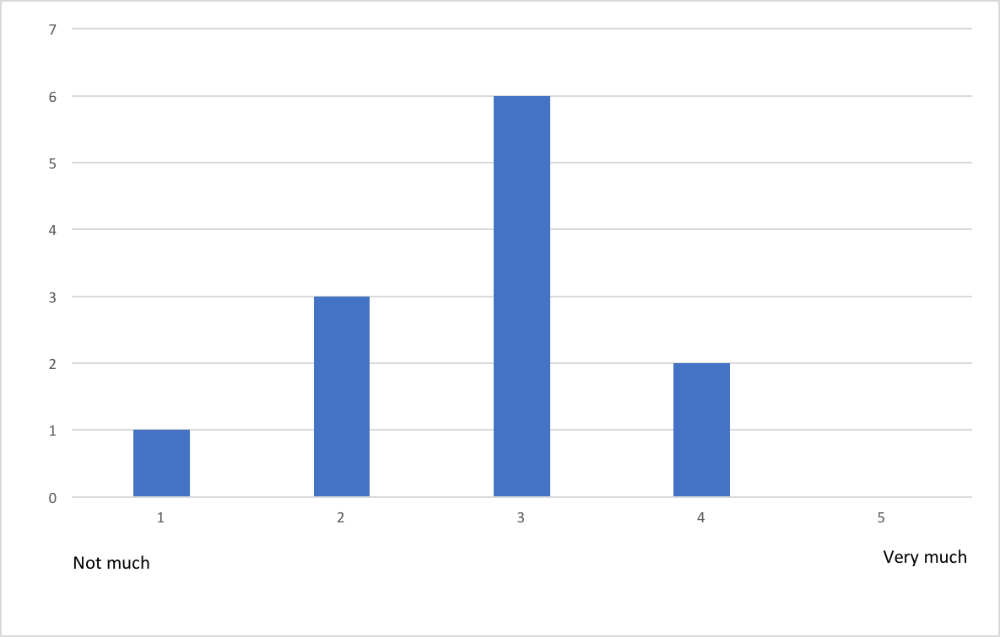
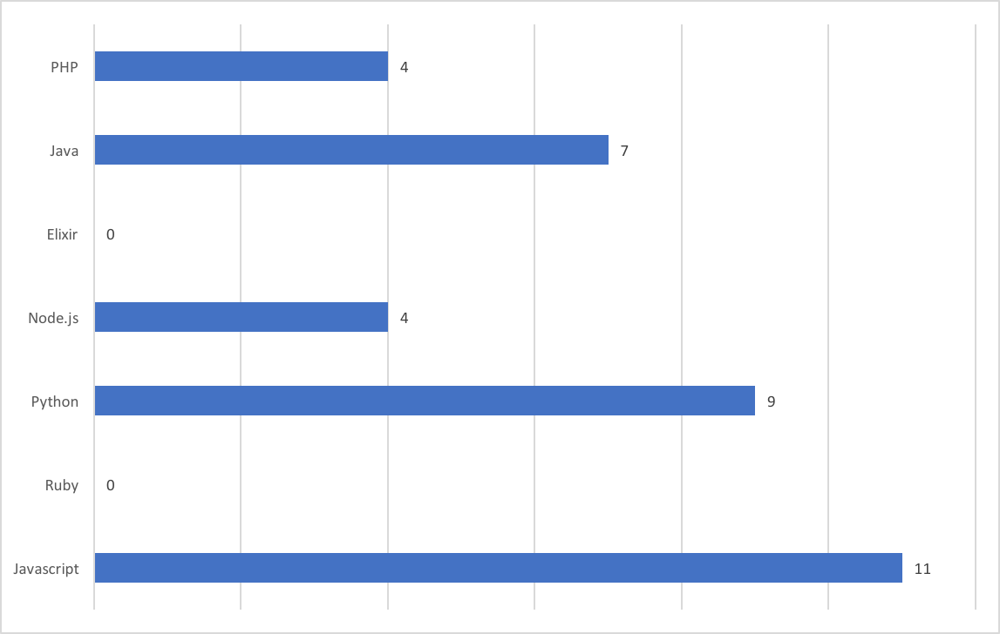
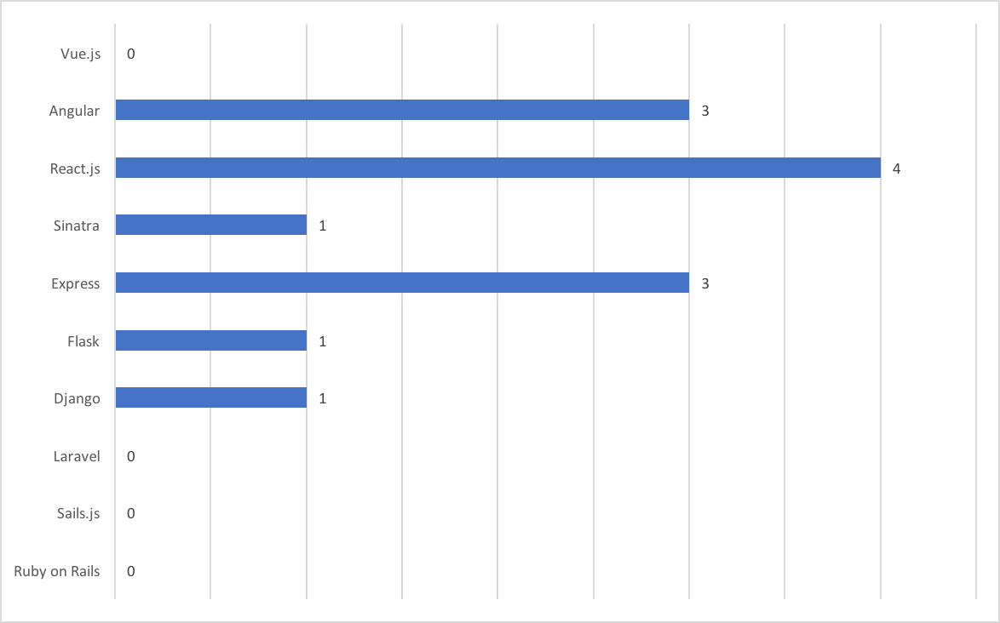
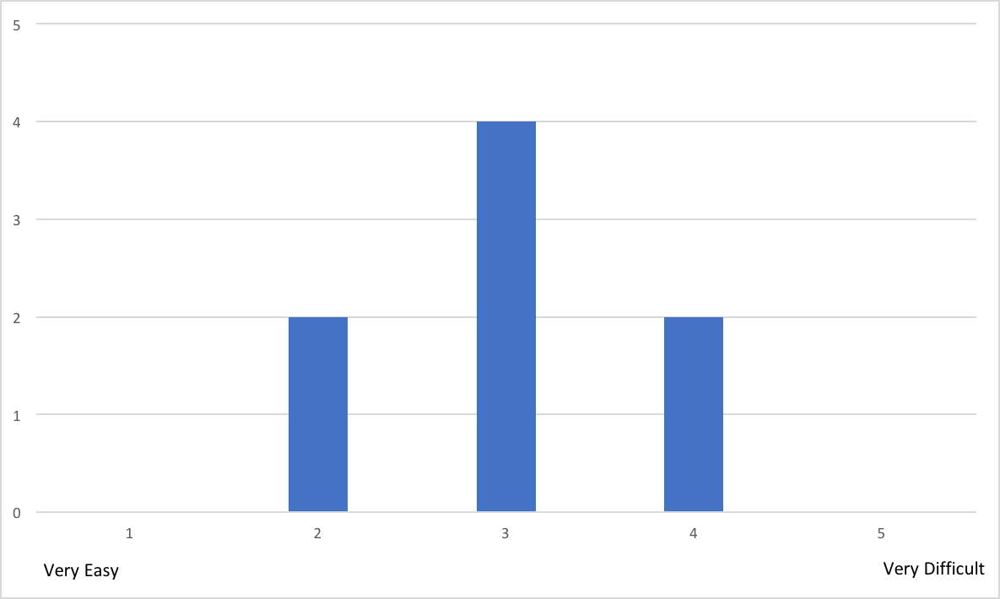

#	Development Evaluations

The questionnaire included in this section was used to evaluate different aspects of the reTHINK system and its development framework. The main goal with this questionnaire was to collect feedback in reTHINK Beta Tester Event organized on the 27th of May for a limited number of “friendly” developers. This questionnaire was divided into seven sections. One section for teams presentation and background, five sections where each corresponds to a challenge and then a last section for overall evaluation.

The feedback collected from this survey will be used to detect and improve all the weak parts of the framework, making the system more usable. It will also allow measuring the understanding of the most important concepts to improve the documentation and training material.

This event was a success, which allowed to collect a considerable number of answers. The following preliminary conclusions are highlighted:

  *
  *
  *
  *
  *

# Survey - Teams presentation and background

This section of the survey was used to collect information about all participants. Participants could run alone or in teams of two elements. In total, this event had twelve participants.

1. What is your name?

  - Fabian Naef
  - Pedro Rocha
  - Ivo Pires
  - CLAUDE-ROGER ISMAN
  - Vitor Paiva
  - Pedro Cipriano
  - Adriano da Conceição Anastácio
  - Diogo Pereira
  - Filipe Correia
  - Luis Oliveira
  - Raquel Cristóvão
  - Tiago Mourão Lopes

2. How old are you?

  - 20 (3)
  - 23 (3)
  - 70
  - 28 (2)
  - 22
  - 21

3. What is your genre?

  - Male (11)
  - Female (1)

4. What is your academic background?

  - Electronics and Electrical Engineering (2)
  - MSC
  - BSC
  - Computer Science Engineer (5)
  - Telecommunications Engineer
  - ENGINEER ( X67 + ENPC72 )

5. How much knowledge do you have about web application development?

6. Do you have any experience with frameworks for web application development?

  - Yes (5)
  - No (7)

7. Select all the programming languages that you already work with.

8. Select all the frameworks for web application development that you already work with.

# Survey - First challenge

This section corresponds to the first challenge of the event that each team had to complete. Basically, the main goal of this first challenge was to provide the first contact with the reTHINK framework. Each team had to developed a simple web application that should use an Hyperty called CodeGeneratorReporter, taking advantage of its features. This challenge was divided into two tasks. The first task was to install the reTHINK framework and to load the CodeGeneratorReporter hyperty. The second task was to use the features of the loaded hyperty.

1. How easy was to include Hyperties in your application?

Most relevant comments to the previous question:

  * Without the tutorial and further instructions, we would have taken a lot more time.
  * After launching and installing, it was difficult to understand that authentication was needed and where to find to google button to authenticate

2. How much knowledge about reTHINK did you think is required?

Most relevant comments to the previous question:

  * You have to have minimal understanding of the framework (conceptually) to be able to understand how to use it.
  * It's needed a good knowledge because is lacking some documentation

3. How much time did you spent reading the documentation? (estimate)

  - 2h
  - 20min (2)
  - 10min
  - 30min
  - 15min (2)
  - 1h

4. Did you manage to easily test and debug your application?

  - Yes (8)
  - No (0)

Most relevant comments to the previous question:

  * The application itself was simple enough that testing and debugging were not a big problem. However, the rethink library logging is maybe a little too verbose.

5. How much time did you spent in the 1st task? (estimate)

  - 15min (2)
  - 10min
  - 30min
  - 3h
  - 20min
  - 50min
  - 1h

#### Note: Our estimate for this task was 45 minutes. The average time of the participants was 47,5 minutes.

6. How much time did you spent in the 2nd task? (estimate)

  - 10min
  - 1h
  - 1h45min
  - 2h (2)
  - 20min
  - 35min
  - 5min

#### Note: Our estimate for this task was 30 minutes. The average time of the participants was 44,375 minutes.

7. Which task gave you the most trouble? And why?

  - No problem (4)
  - Task 1, due to misunderstanding of the script (2)
  - The second task was warder because of some misunderstandings (2)

8. Did you manage to use the Identity Management features?

[2-8]()

Most relevant comments to the previous question:

  * Unfortunately only google appeared to work.
  * It was difficult to understand that authentication was needed and where to find to google button to authenticate
  * It did not seem to work very well. For example, I tried to login using Slack, but it would always open a Google authentication page, even though the page clearly displayed Slack as the IDP. It was also not possible to add a second Google account.

9. Let us know what limitations you found and how you would improve it.

  - It would be useful (at least for developers) to be able to use anonymous identities.
  - Excessive Logging
  - When a user can authenticate with the Google Services, a dedicated button should be displayed, instead of being inside a dropdown menu
  - Better documentation and some good tutorials to get people started
  - The main limitation I identified was with the identity management feature

10. Classify your experience with reTHINK in this first challenge.

[2-10]()

#### Conclusion:
Each team completed with success this first challenge and we were able to collect very useful feedback about reTHINK and its features. There were positive aspects, such as:

  * Even with minimal knowledge about web application development, all participants were able to use reTHINK and complete this challenge;
  * All participants considered reTHINK easy to use;
  * All participants considered easy to load Hyperties into their web applications.

However, we collect also some negative aspects that should be considered, such as:

  * Authentication GUI, in terms of user interface, was difficult to understand for some participants;
  * Without the tutorials and instructions available during the event, the participants recognized that would take much longer to complete all the tasks;
  * Lack of documentation;
  * The rethink library logging is maybe a little too verbose.

# Survey - Second challenge
