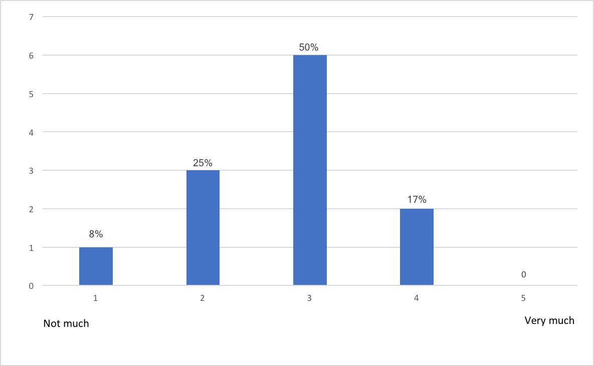
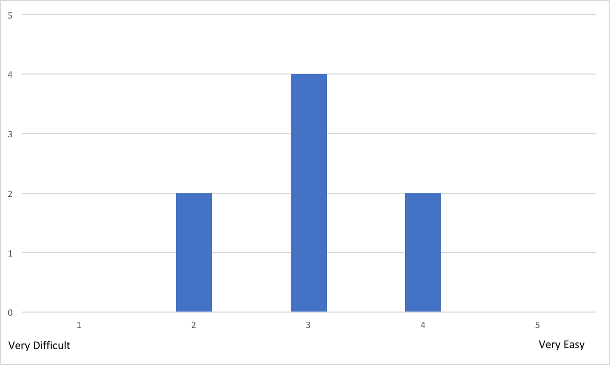
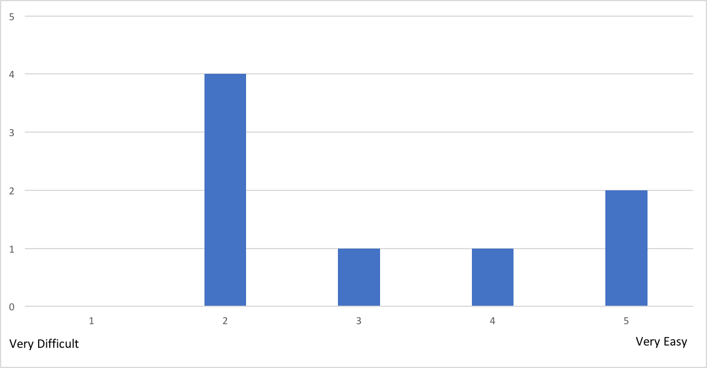
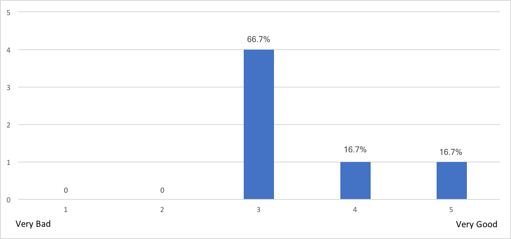
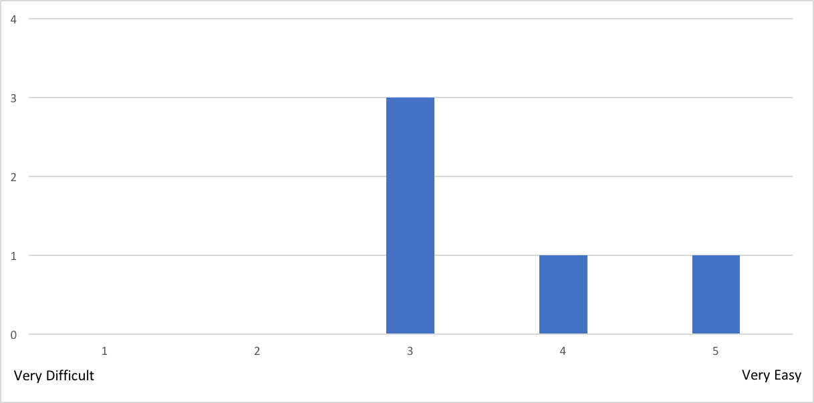
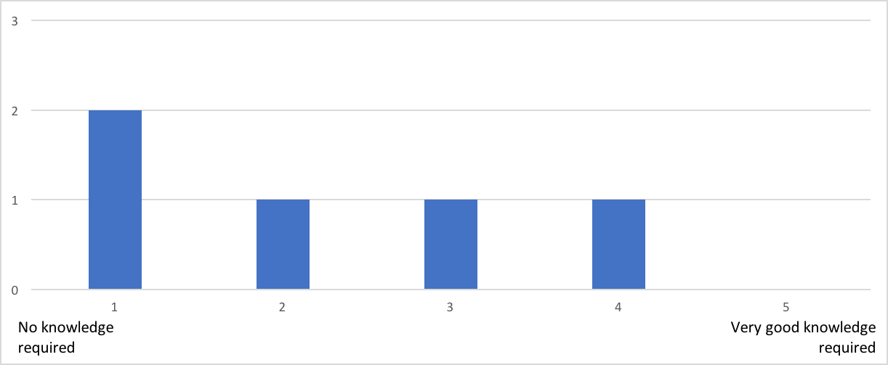
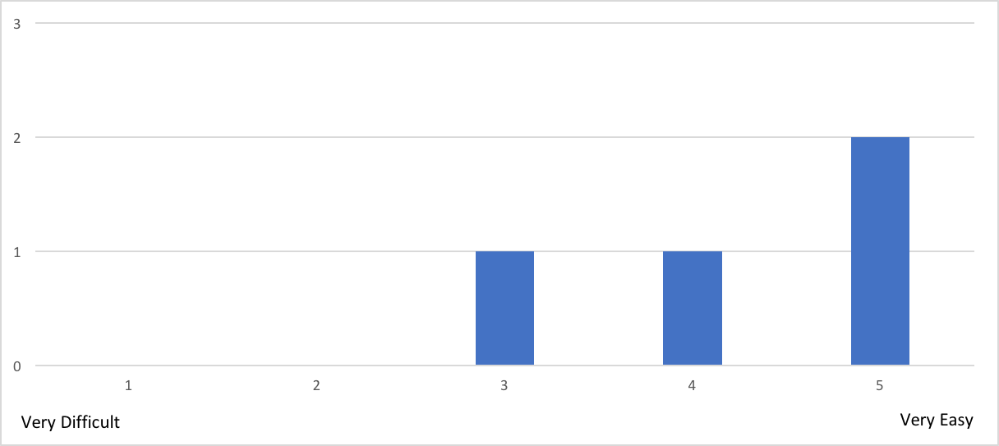
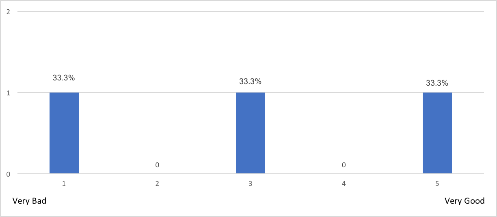
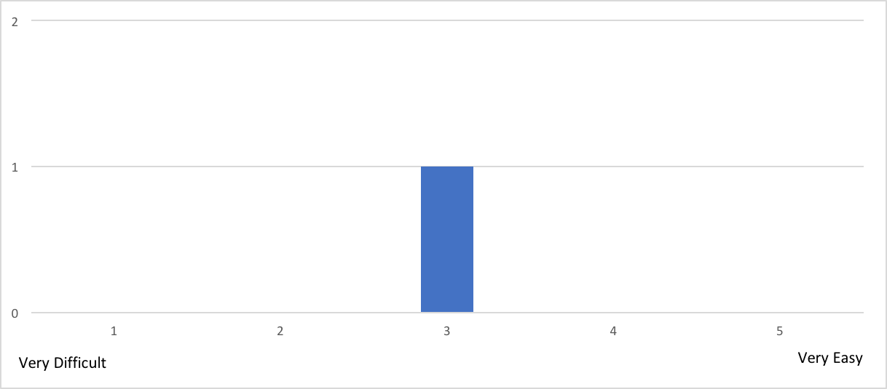

#	Development Evaluations

The questionnaire included in this section was used to evaluate different aspects of the reTHINK system and its development framework. The main goal with this questionnaire was to collect feedback in reTHINK Beta Tester Event organized on the 27th of May for a limited number of “friendly” developers. This questionnaire was divided into seven sections. One section for teams presentation and background, five sections where each corresponds to a challenge and then a last section for overall evaluation.

The collected feedback from this survey will be used to detect and improve all the weak parts of the framework, making the system more usable. It will also allow measuring the understanding of the most important concepts to improve the documentation and training material.

This event was a success, which allowed to collect a considerable number of answers. The following preliminary conclusions are highlighted:

  *	Participants found Hyperties are easily integrated in Apps. However, more examples are required
  * All participants considered reTHINK easy to use
  * The reTHINK library logging is too verbose
  * Documentation needs a huge improvement
  * All participants recognized that would use reTHINK framework again in future projects
  * Would be great if reTHINK works in different browsers
  * Authentication GUI needs improvements in terms of user interface
  * The Hyperty toolkit was appreciated by participants
  * Would be great if reTHINK had built-in integration with front-end frameworks and examples

# Survey - Teams presentation and background

This section of the survey was used to collect information about all participants. Participants could run alone or in teams of two elements. In total, this event had twelve participants divided into eight teams.

1. What is your name?

  - Fabian Naef
  - Pedro Rocha
  - Ivo Pires
  - CLAUDE-ROGER ISMAN
  - Vitor Paiva
  - Pedro Cipriano
  - Adriano da Conceição Anastácio
  - Diogo Pereira
  - Filipe Correia
  - Luis Oliveira
  - Raquel Cristóvão
  - Tiago Mourão Lopes

2. How old are you?

  - 20 (3)
  - 23 (3)
  - 70
  - 28 (2)
  - 22
  - 21

3. What is your genre?

  - Male (11) - 91,67%
  - Female (1) - 8,33%

4. What is your academic background?

  - Electronics and Electrical Engineering (2)
  - MSC
  - BSC
  - Computer Science Engineer (5)
  - Telecommunications Engineer
  - ENGINEER ( X67 + ENPC72 )

5. How much knowledge do you have about web application development?

6. Do you have any experience with frameworks for web application development?

  - Yes (5) - 58,33
  - No (7) - 41,67

7. Select all the programming languages that you already work with.

8. Select all the frameworks for web application development that you already work with.

# Survey - First challenge

This section corresponds to the first challenge of the event that each team had to complete. Basically, the main goal of this first challenge was to provide the first contact with the reTHINK framework. Each team had to developed a simple web application that uses an hyperty called CodeGeneratorReporter, taking advantage of its features. This hyperty provides a numerical code depending of the team name that should be passed as input. This challenge was divided into two tasks. The first task was to install the reTHINK framework and to load the CodeGeneratorReporter hyperty. The second task was to use the features of the loaded hyperty.

1. How easy was to include Hyperties in your application?

Most relevant comments to the previous question:

  * Without the tutorial and further instructions, we would have taken a lot more time.
  * After launching and installing, it was difficult to understand that authentication was needed and where to find to google button to authenticate

2. How much knowledge about reTHINK did you think is required?

Most relevant comments to the previous question:

  * You have to have minimal understanding of the framework (conceptually) to be able to understand how to use it.
  * It's needed a good knowledge because is lacking some documentation

3. How much time did you spent reading the documentation? (estimate)

  - 2h
  - 20min (2)
  - 10min
  - 30min
  - 15min (2)
  - 1h

4. Did you manage to easily test and debug your application?

  - Yes (8) - 100%
  - No (0)

Most relevant comments to the previous question:

  * The application itself was simple enough that testing and debugging were not a big problem. However, the rethink library logging is maybe a little too verbose.

5. How much time did you spent in the 1st task? (estimate)

  - 15min (2)
  - 10min
  - 30min
  - 3h
  - 20min
  - 50min
  - 1h

##### Note: Our estimate for this task was 45 minutes. The average time of the participants was 47,5 minutes.

6. How much time did you spent in the 2nd task? (estimate)

  - 10min
  - 1h
  - 1h45min
  - 2h (2)
  - 20min
  - 35min
  - 5min

##### Note: Our estimate for this task was 30 minutes. The average time of the participants was 44,375 minutes.

7. Which task gave you the most trouble? And why?

  - No problem (4)
  - Task 1, due to misunderstanding of the script (2)
  - The second task was warder because of some misunderstandings (2)

8. Did you manage to use the Identity Management features?

Most relevant comments to the previous question:

  * Unfortunately only google appeared to work.
  * It was difficult to understand that authentication was needed and where to find to google button to authenticate
  * It did not seem to work very well. For example, I tried to login using Slack, but it would always open a Google authentication page, even though the page clearly displayed Slack as the IDP. It was also not possible to add a second Google account.

9. Let us know what limitations you found and how you would improve it.

  - It would be useful (at least for developers) to be able to use anonymous identities.
  - Excessive Logging
  - When a user can authenticate with the Google Services, a dedicated button should be displayed, instead of being inside a dropdown menu
  - Better documentation and some good tutorials to get people started
  - The main limitation I identified was with the identity management feature

10. Classify your experience with reTHINK in this first challenge.

### Conclusion:
Each team completed with success this first challenge and we were able to collect very useful feedback about reTHINK and its features. There were positive aspects, such as:

  * Even with minimal knowledge about web application development, all participants were able to use reTHINK and complete this challenge;
  * All participants considered reTHINK easy to use;
  * All participants considered easy to load Hyperties into their web applications.

However, we collect also some negative aspects that should be considered, such as:

  * Authentication GUI, in terms of user interface, was difficult to understand for some participants;
  * Without the tutorials and instructions available during the event, the participants recognized that would take much longer to complete all the tasks;
  * Lack of documentation;
  * The reTHINK library logging is maybe a little too verbose.

# Survey - Second challenge

This section corresponds to the second challenge of the event that each team had to complete. Basically, the main goal of this second challenge was to combine multiple hyperties into a web application. Each team had to developed a much more complex web application, in terms of user interface, that uses the CodeGeneratorReporter and GroupChatManager hyperties. This challenge was divided into three tasks. The first task was to load two hyperties. The second task was to develop all the user interface to deal with all the features of the GroupChatManager hyperty e.g. creation of chat rooms, sending messages (chat capabilities). And finally, the third task was to combine the two loaded hyperties.

1. How easy was to include more than one Hyperty in your application?

2. Were the used Hyperties well documented?

  - Yes (5) - 62,5%
  - No (3) - 37,5%

Most relevant comments to the previous question:

  * The documentation is OK, but sometimes not entirely clear.

3. How much knowledge about reTHINK did you think is required?

Most relevant comments to the previous question:

  * You can get it working with only basic knowledge, but then you may find some things a bit confusing (for example, the domain when inviting users).

4. How much time did you spent reading the documentation? (estimate)

  - 1h
  - 5min (5min)
  - 2h
  - 20min
  - 30min
  - 3h
  - 15min

5. How much time did you spent in the 1st task? (estimate)

  - 1h
  - 10min (2)
  - 20min (2)
  - 30min
  - 5min (2)

##### Note: Our estimate for this task was 15 minutes. The average time of the participants was 18,75 minutes.

6. How much time did you spent in the 2nd task? (estimate)

  - 2h
  - 30min
  - 3h (2)
  - 1h
  - 1h40min
  - 2h15min

##### Note: Our estimate for this task was 150 minutes. The average time of the participants was 115 minutes.

7. How much time did you spent in the 3rd task? (estimate)

  - 5min (2)
  - 30min (2)
  - 40min
  - 45min

##### Note: Our estimate for this task was 15 minutes. The average time of the participants was 25,83 minutes.

8. Which task gave you the most trouble? And why?

  - The second task, especially the user join (2)
  - In the third task there was a small problem when trying to authenticate with a anonymous mozilla tab were the menu would not normally appear, giving an error on the console, in chrome it worked as normal (2)

9. If you had to implement another chat application would you choose reTHINK framework again?

  - Yes (6) - 100%
  - No (0)

10. Justify your answer to the previous question.

  - With the experience we have now, it is quite easy and intuitive to implement this functionality using reTHINK.
  - Ease of use
  - Even tho it was hard to start with some practice from myself the framework would be great to make new projects in the future
  - After realizing the operation is relatively simple and simplifying the use compared to the traditional method
  - It is relatively simple to use but needs better documentation
  - The yes is actually a maybe. I think there are some good things in reTHINK. It was very easy to create a chat room, invite other users and send messages. However, I am concerned about the stability of the platform. I often experienced timeouts and strange errors that would only go away after clearing the cache.

11. If your answer was "No" to question 9, which framework/libraries would you choose then? And why?

  - I'm not sure. I'm not very familiar with the options out there. I might take look at XMPP, but I would probably not want to use it for a simple chat application on the web.

12. Let us know what limitations you found and how you would improve it.

  - Async system not fully functional
  - The only problem I had with the framework was when trying to authenticate with the anonymous firework page
  - It's mostly lack of documentation and having to use ".instance" to access methods is unintuitive
  - Frequent errors/timeouts.

13. Classify your experience with reTHINK in this second challenge.

### Conclusion:
Only four teams were able to complete this second challenge with success. In spite of this, it was still possible to collect some useful feedback about reTHINK and its features. There were positive aspects, such as:

  * The participants recognized that if they had a bit more practice with the framework, they would use it in future projects;
  * All participants would use reTHINK framework again to develop new chat applications;
  * It is quite easy and intuitive to implement chat functionality using reTHINK.

However, we collect also some negative aspects that should be considered, such as:

  * Lack of documentation and sometimes not entirely clear;
  * Problems arise if the used browser is not Chrome;
  * Some timeout errors and no explanation for them;
  * The fact that it is necessary to clean the cache constantly is a bit dull.

# Survey - Third challenge

This section corresponds to the third challenge of the event that each team had to complete. Basically, the main goal of this third challenge was to change the CodeGeneratorReporter hyperty functionality, reusing the previous developed application. Now, this hyperty should generate a code and a timestamp depending of the team name that should be passed as input. This challenge was divided into two tasks. The first task was to configure the hyperty toolkit, following the available documentation on the reTHINK repository. The second task was to change the hyperty functionality and to use it in the developed application.

1. How easy was to setup the reTHINK environment in your local machine?

  

Most relevant comments to the previous question:

  * We had problems installing the correct branch (so, our fault), but the branch had a mistake.

2. How much knowledge about reTHINK did you think is required?

  

3. How much time did you spent reading the documentation? (estimate)

  - 10min (2)
  - 3h
  - 30min

4. Did you have problems with the reTHINK environment configuration? Justify.

  * No (2)
  * No, most problems were small mistakes on the developer's end.
  * My Ubuntu 17.04 did not have a "node" binary, instead it is called "nodejs". I had to apt install nodejs-legacy for the build to work.  I also had a problem when running it because it was trying to bind to a low port (<1024). I figured it out pretty quickly, but the error message is not very descriptive. I also eventually found a note about this in the Wiki, but by that time I had already Googled the problem and solved it. It would be better to mention it in the README, because everyone who uses Linux is going to have the same problem.

5. How much time did you spent in the 1st task? (estimation)

  - 1h30min
  - 25min
  - 1h
  - 30min

#### Note: Our estimate for this task was 35 minutes. The average time of the participants was 51,25 minutes.

6. How much time did you spent in the 2nd task? (estimation)

  - 5min
  - 0
  - 20min
  - 3h

#### Note: Our estimate for this task was 40 minutes. The average time of the participants was 51,25 minutes.

7. How easy was to change the Hyperty functionality?

  

8. Let us know what limitations you found and how you would improve it.

  * Only being able to have 1 tab open loading a certain hyperty lost us a bit of time.

9. Classify your experience with reTHINK in this third challenge.

  

#### Conclusion:
Only two teams were able to complete this third challenge with success. In spite of this, it was still possible to collect some useful feedback about the development of hyperties. There were positive aspects, such as:

  * Most of the participants considered easy to setup the reTHINK development environment (hyperty toolkit);
  * Most of the participants considered easy to change the hyperty functionality.

However, we collect also some negative aspects that should be considered, such as:

  * Lack of documentation;
  * Only being able to have 1 tab open loading a certain hyperty.

# Survey - Fourth challenge

This section corresponds to the fourth challenge of the event that each team had to complete. Basically, the main goal of this fourth challenge was to develop a video conference application. This application should cover some functional requirements, such as creation of chat rooms with the possibility of inviting users to join in, A/V calls between users and the possibility to make A/V calls at the same time that a chat room is available (exchanging messages). This was an open challenge in which the participants could choose hyperties already available or develop their own hyperties.

Unfortunately, neither team managed to finish this challenge in time. Below are listed all the questions and some of the collected answers.

1. Did you choose to develop new Hyperties? If yes, describe them briefly. If not, pass to the sixth question.

2. How easy was to develop new Hyperties?

3. How much knowledge about reTHINK did you think is required?

4. How much time did you spent reading the documentation? (estimate)

5. Which features did you tried to implement that gave you the most trouble? After answer to this question, pass to the tenth question.

6. Which Hyperties did you use?

    - CodeGeneratorReporter, GroupChatManager and Connector
    - GroupChatManager

7. In your opinion, how hard would it be to develop new hyperties?

  

Most relevant comments to the previous question:

  * We didn't have time to attempt to create a hyperty from scratch, so we cannot infer the difficulty. Based on changes made in challenge 3, it seems manageable
  * It's hard to tell. Modifying the hyperty in challenge 3 was very easy, but I did nothave the chance to build a new one from scratch. Still, looking at the code of the existing hyperties, it does not seem too difficult.

8. Did you try to change or add new functionalities to the used Hyperties?

  - No (2)
  - Yes (0)

9. If your answer to the previous question was "yes", what did you try to implement?

10. Let us know what limitations you found and how you would improve it.

11. Classify your experience with reTHINK in this fourth challenge.

  

# Survey - Fifth challenge

This section corresponds to the fifth challenge of the event that each team had to complete. Basically, the main goal of this fifth challenge was to develop a new hyperty from scratch. Each team was free to design the hyperty, as well as the web application that uses it.

Unfortunately, no team started to do this challenge, so we could not collected answers. Below are listed all the questions.

1. Describe briefly the developed web application.

2. Describe briefly the developed hyperties.

3. How easy was to develop new Hyperties?

4. How much knowledge about reTHINK did you think is required?

5. How much time did you spent reading the documentation? (estimate)

6. How useful and complete is the available documentation to support the development of Hyperties?

7. Please provide your suggestions to improve the documentation.

8. Which features did you tried to implement that gave you the most trouble?

9. Classify your experience with reTHINK in this fifth challenge.

# Survey - reTHINK Global Evaluation

1. Which framework for web application development would you recommend? And why?

  - reTHINK
  - Never used frameworks to develop web applications
  - We haven't used other web frameworks
  - ReactJs, as it has a healthy community, it is well supported, large heaps of documentation and the developer experience in general is very pleasant.
  - I don't have enough experience with web frameworks to make a recommendation

2. Taking into account your experience in web application development, how do you compare reTHINK framework with other web frameworks?

  - I liked reTHINK but hadn't much experience with others
  - We haven't used other web frameworks
  - All the challenges we did were easy to implement with reTHINK. Unfortunately, we couldn't experience how it would work when used with a real-life application, but we consider it would be manageable. It needs more extensive documentation, especially on the demos.
  - Again, not enough experience to compare.

3. How easy was to understand the reTHINK documentation?

  

4. What features of reTHINK framework looks more promising to you?

  - The fast chatrooms creations
  - It's ease to use in projects. Doesn't require much to run in a script
  - We think the most important feature (killer-app) of the reTHINK framework is the possibility of completely different and independent developers developing compatible applications without needing to standardize protocols
  - The best thing about reTHINK is how simple it is to take the "plug-and-play" hyperties and build an application out of them

5. In your opinion, what are the main benefits of using Hyperties?

  - The mainly benefits is maybe the with some training you could achieves good results fast
  - It's easy to use Hyperties in an application
  - Hyperties shine when developing complex applications that need to interact with different domains. It simplifies the process of managing connections, domains, etc, which greatly improves the developer experience
  - Easy discovery. Things seem to "just work" (at least when they don't timeout)

6. What features would you like to see in reTHINK framework?

  - For now none, but we still have to explore the framework better
  - Built-in integration with front-end frameworks and examples
  - More hyperties! I think the best way to popularize it would be to have the basic building blocks ready, so you can quickly build an application out of them

7. Would you recommend reTHINK framework?

  
